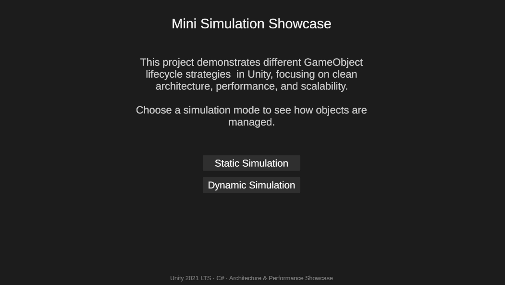
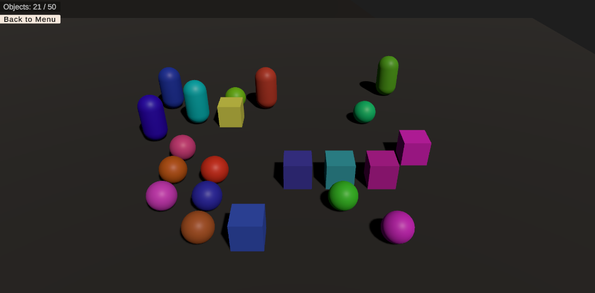

# MiniSimulationShowcase

**Unity Portfolio Project** — demonstrating clean architecture, object lifecycle management, and performance-aware design.

---

## Overview

This project showcases **two types of object spawning simulations**:

1. **Static Mode** – Objects are instantiated once in a grid and reused.
2. **Dynamic Mode** – Objects are continuously spawned; oldest objects are deleted when a limit is reached.

Both modes:

- Avoid overlapping objects using a **grid system**  
- Use **random colors** via a `ColorProvider`  
- Display **UI counters** for active objects  
- Include a **back button** to return to the start menu  

---

## Features Demonstrated

- Clean **C# and Unity architecture**  
- ScriptableObject configuration (`SimulationConfig`)  
- Separation of concerns: **Dynamic / Static / Grid / UI**  
- Object lifecycle management (instantiation & destruction)  
- UI integration with **TextMeshPro**  
- Grid-based collision-free placement  
- Professional **scene and camera setup**  
- **Performance-conscious** spawning  

---

## Getting Started

1. Open `MiniSimulationShowcase` in **Unity 2021.3.23f1** (Built-in RP).  
2. Open `StartScene` to choose **Static** or **Dynamic** simulation.  
3. Run the scene: objects will spawn, counters update, and the **Back to Menu** button works.  

---

## Screenshots

  

---

## Future Improvements

- Add more prefab types  
- Add different spawn patterns  
- Add UI controls to adjust max objects and spawn interval at runtime  
- Add more polish to UI animations and effects  

---

## Author

**Vinicius Marcondes Bacca** — Unity Developer & Software Engineer  
[LinkedIn](https://www.linkedin.com/in/viniciusmarcondesbacca/) | [GitHub](https://github.com/VMBacca/MiniSimulationShowcase)

